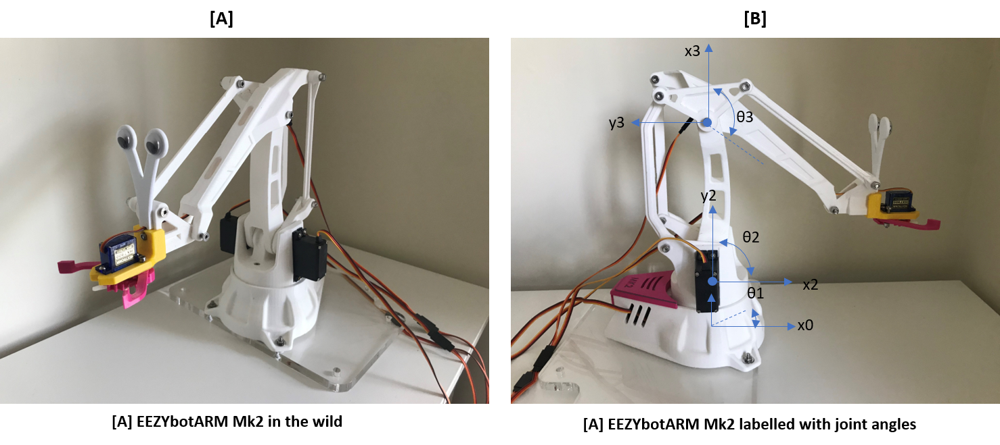
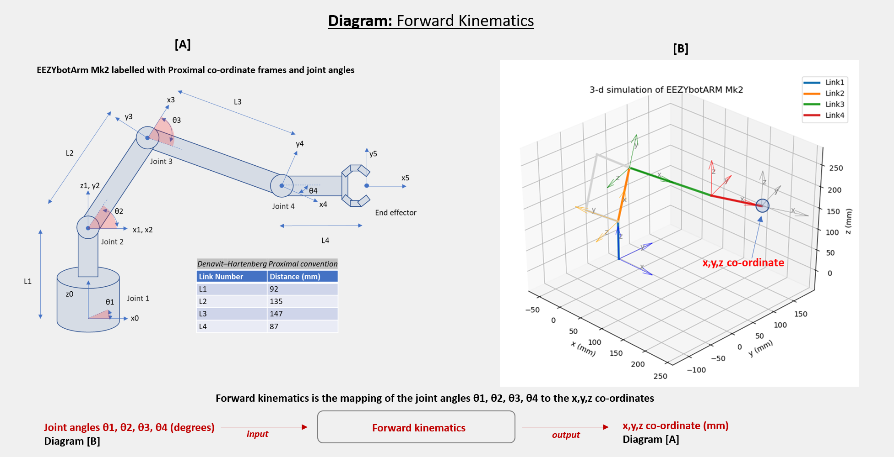
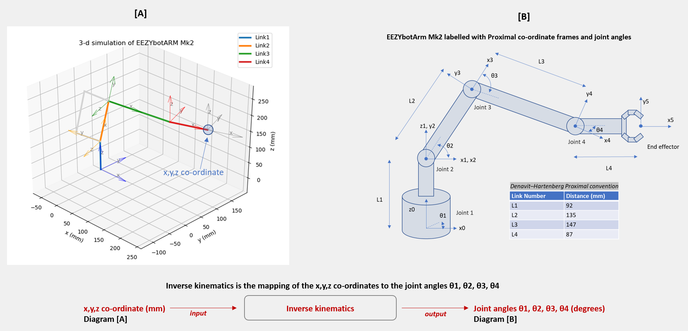
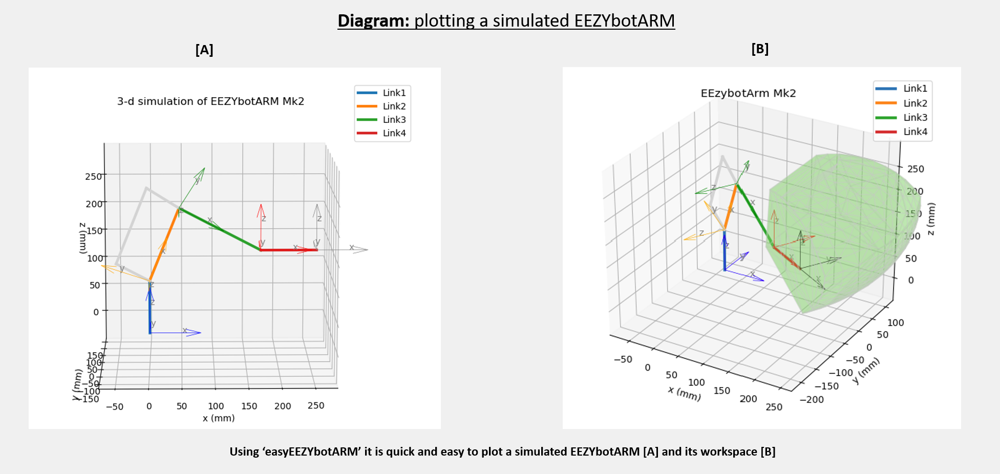
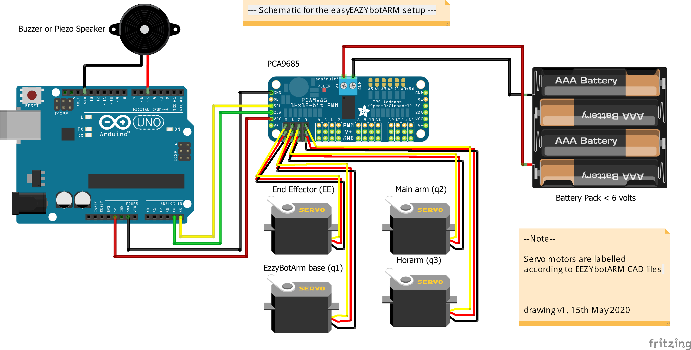
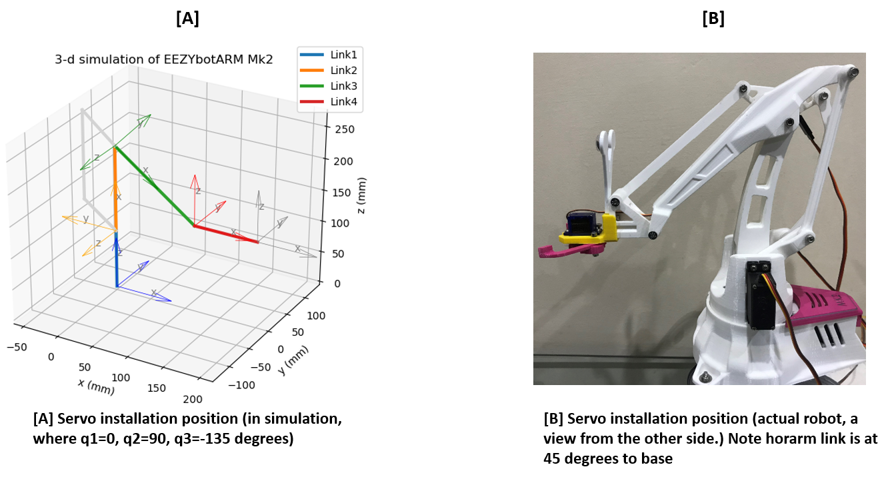
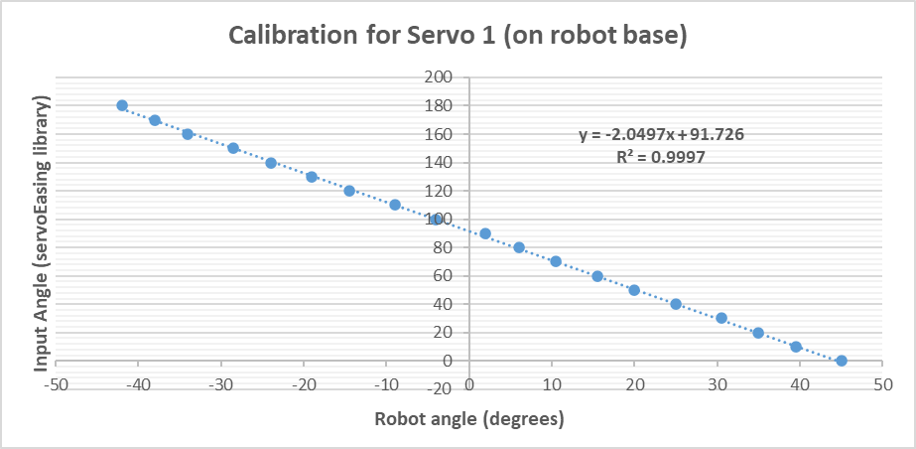
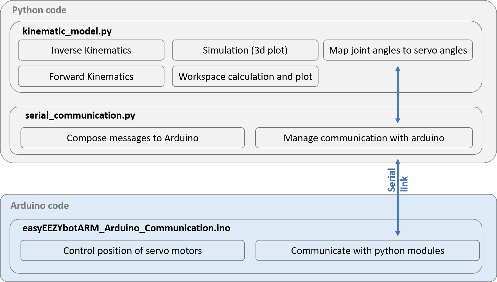

# easyEEZYbotARM

### [Version 0.2-alpha](https://github.com/meisben/easyEEZYbotARM/releases)

[](https://github.com/brentvollebregt/hit-counter)

A python and arduino controller for the EEZYbotARM Mk1 & Mk2 (Includes 3-D kinematics).

EEZYbotARMs are a range of open source 3d-printable robot arms designed by Carlo Franciscone. 



## Contents

- Introduction
- Overview
- Installation
- Configuration(of the physical arduino setup)
- Guidance on use
- Help and updates

## Introduction

This code library provides functionality to control the EEZYbotARM (Mk1, Mk2) in 3-D space. Specifically its functionality includes: 

1. 3-D Forward kinematics
2. 3-D Inverse kinematics
3. Plotting of the (simulated) robot arm
4. Plotting of the (simulated) workspace of the robot arm
5. Communicating with a (arduino) microcontroller
6. Using the (arduino) microcontroller to control the movement of the robot arm servo motors

## Overview

### Forward Kinematics
The code library allows the user to easily map joint angles to an x,y,z co-ordinates, so that we know the position of the end effector


### Inverse Kinematics
The code library allows the user to easily map x,y,z co-ordinates to joint angles, so that the EEZYbotARM can be controlled in 3-D space


### Simulation the robot arm, and plotting the robot arm workspace
The code library allows the user to easily plot a (simulated) robot arm. It is easy to calculate and plot the robot arm workspace. As well as checking whether a cartesian (x,y,z) point is within or outside the workspace.


## Installation 
This code library is distributed with python and arduino components. The python code is responsible for high level kinematics calculations and simulation. The arduino code is responsbile for low level servo control.

### Installation (python)

This python code is distributed as a python package. A setup file is included and so dependent libraries should install with the package. :)

To install the package on Windows, OS X or Linux:

1. Download the easyEZZYbotARM zip file or clone the github repository
2. [Optional] Create a virtual environment (e.g. using conda or venv), then activate it in a terminal window
3. Then open a terminal window and navigate to the setup.py directory using the 'cd' command
4. Install the package using the pip command:

```sh
pip install -e .
```

This will create an editable install of the easyEZZYbotARM library

A future aim is to distribute this module using pip

### Installation (arduino)

To install the arduino code it is as simple as uploading the sketch 'arduino_sketches\easyEEZYbotARM_Arduino_Communication' to the arduino microcontroller.

The easiest way to do this is using the arduino IDE, see instructions at: https://www.arduino.cc/en/Main/Software 

The arduino software uses ArminJo's ServoEasing library so that the motions of the servo motors are smooth and not sudden 'jolts'. **Important:** You must uncomment the line `#define USE_PCA9685_SERVO_EXPANDER` in the file *ServoEasing.h* (as per the instructions for ServoEasing). The file *ServoEasing.h* can be found in the [Arduino libraries directory](https://www.arduino.cc/en/guide/libraries). 

## Configuration (of the physical arduino setup)

This is the reference setup using the 'easyEZZYbotARM' repository. The servo motors represent the servo motors mounted on the EEZYbotARM. The PCA9685 is a widely available low cost board designed by Adafruit. The battery pack could be replaced by any DC power source < 6 volts.


This diagram is created using Fritzing. The Fritzing files can be found at '/fritzing_files'

## Building the EEZYbotARM

- Instructions for building a EEZYbotARM can be found here: http://www.eezyrobots.it/eba_mk2.html
- Chris Riley has a great step by step video of the EEZYbotARM mk2 on youtube: https://www.youtube.com/watch?v=R2MI-tpXyS4
- If you are looking for the googly eyes extension you can find it here!: https://www.thingiverse.com/thing:4370985

**Important:** Please read the next *Calibrating the EEZYbotARM* section before you install servo motors into the robot arm.

## Calibrating the EEZYbotARM

For us to be able to control the robot arm, it's really important that the servo motors are installed in **known** 'reference positions' and that we understand how they behave. This is a two step process !

### Servo installation position procedure

The servo motors (for angles q1, q2, q3) should be installed following the instructions below.

1. Command the servo motor angles to 90 degrees using an Arduino script which sends PWM (Pulse width modulation) signals to the servo. You can use the [ServoEasing](https://github.com/ArminJo/ServoEasing) library for this purpose.
2. Position the EEZYbotARM links as shown in the diagram below
3. Attach the servo arms (the bits of plastic that attach to the motor) and install the motors so that they remain in the 90 degree position, when the EEZYbotARM links are in the position below.

The aim of this installation procedure is to install the servo motors in a known reference position.



### Improving the accuracy of the robot arm (or troubleshooting positional accuracy)

**Please note:** *what is described in this sub-section is only currently implemented for the q1 servo motor in the easyEZZYbotARM library based on experimental values for a test robot. This is because it is strictly necessary for the q1 (base) servo motor. You can edit this for your particular motors (q2,q3) in the `map_kinematicsToServoAngles` function in the easyEEZYbotARM python library. Doing so will improve the positional accuracy of the robot arm*

Because the robot arm is using *'hobby servo motors'*, they don't always behave like we expect them to! For example, say we command a hobby servo (using pulse width modulation) to travel to an angle of 120 degrees, and then move to an angle of 70 degrees. If we measure these angles we are likely to find they are quite a way out! This makes a big difference to how the robot arm moves, so we need to correct any errors before we install the servo motors. An example of a setup to do this is shown in the video below

[](https://www.youtube.com/watch?v=GVBDZIZc2mw)

A reasonable way to do this is to command the servo motor to positions in increments of 10 degrees, and to measure the actual position of the motor. This can be recorded in a spreadsheet, so that we can map between a (demanded) input and an (actual) output using a linear function. An example of this (for the robot arm base servo motor) is given in this [excel sheet](resources/example_servo_calibration.xlsx). The graph produced from this is shown here.



A [linear relationship](https://www.mathsisfun.com/equation_of_line.html) can be estimated from this data (using excel line of best fit). The equation for this is displayed on the chart. You can see that this exact equation is implemented in the easyEEZYbotARM libary, this mapping between the (demanded) input and an (actual) output is implemented (for the q1 base servo motor) as follows:

```python
# Calculate for q1
servoAngle_q1 = ((-2.0497)*q1) + 91.726  # from experimentation !
servoAngle_q1 = round(servoAngle_q1, 2)
```

I haven't experimented with lots of hobby servo motors, but I suspect that they are all a bit different in their performance between demanded value, and actual output. If your robot arm isn't quite in the right position (but almost is), then this could be something to optimise!

## Guidance on use

### Examples

- For examples of basic usage see the '/examples' folder

### Software Architecture



## Bug list

- Currently no bugs are listed here

## Help and updates

If you need help using this code libray, please in the first instance try googling your problem to see if you can find a solution. If that doesn't help then please do feel free to initiate a pull request on github.

## Contributing

Anyone is very welcome to contribute - please do. Below is a list of identified improvements.

Some useful best practice guidelines are here: https://opensource.guide/how-to-contribute/

### To do (improvements)

- Kinematic Equations: These will be documented in a seperate web post
- Add example for plotting workspace
- Add instructions for installing servo motors and calibrating
- Make plot (simulation) of virtual robot arm non blocking
- Tidy up code
- Seperate plotting function and D-H functions for calculating joint frame and link positions

## Limitations

- Because the servo motors are 'hobby motors' without position feedback to the python library it's not possible to create 'straight line' type trajectories using the EEZYbotARM. If you are looking for this functionality (outside of a hobby project) I suggest using a robot arm which already implements this out of the box. For example the niryo one arm or the dobot magician arm.
- Because the servo motors are 'hobby motors' they may heat up after prolonged use and loose acurracy. This depends on what activity they are undertaking, but is likely to ocurr when lifting any kind of load that isn't 'very light'.

## Thanks and credit

-	Thanks to you for reading this and considering using this code library 
-	A big thanks to Carlo Franciscone for open sourcing the [EEZYbotARM](http://www.eezyrobots.it/eba_mk2.html)
-   A big thanks to ArminJo for creating the fantastic arduino [ServoEasing library](https://github.com/ArminJo/ServoEasing)
-	A big thanks to Dr Antonia Tzemanaki at the University of Bristol / University of the West of England robotics course, what an amazing teacher.
-	Thanks to Professor Angela Sodemann and Professor Peter Corke for putting their wonderful courses on inverse and forward kinematics online. You can find these courses [here](https://www.youtube.com/playlist?list=PLT_0lwItn0sAfi3o4xwx-fNfcnbfMrXa7) and [here](https://robotacademy.net.au/)

## Release history

### v0.2-alpha

Added information and resources on calibration and installation positions for the servo motors

### v0.1-alpha

Initial library version

